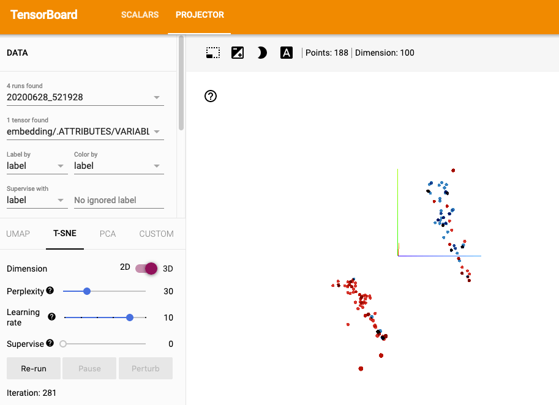

# Unsupervised Neural Message Passing

This is a Tensorflow 2.2.0 implementation of unsupervised learning of molecule representations based on the paper [Semi-supervised learning of hierarchical representations of molecules using neural message passing](https://arxiv.org/abs/1711.10168).

Node features are initialized to a learned embedding for the unique atoms in the dataset.

Molecule representations are based on the readout in Equation 7, taking the input to the classifier without the readout matrix `W` which needs to be learned in a supervised manner. That is, for each molecule, the feature representation is taken to be

&Sigma;<sub>v</sub> &Sigma;<sub>&ell;</sub> softmax(h<sub>v</sub><sup>&ell;</sup>)

## Usage

MUTAG dataset `mutag.tfrecord` can be created by running `data.py`, which depends on `load_mutag.py` and `MUTAG.mat` from [the paper's repository](https://github.com/pfnet-research/hierarchical-molecular-learning). After creating `mutag.tfrecord`, run

```python train.py --epochs 1```

To see a full list of options, `python train.py --help`

## Results

The learned representations can be visualized in the tensorboard projector, as shown below. Adjusting the T-SNE perplexity from Tensorboard's default, reasonable separation is observed between the two classes. 

Navigate to the log directory (defaults to `/tmp/tensorboard/logs`) and start Tensorboard 

```tensorboard --logdir .```


